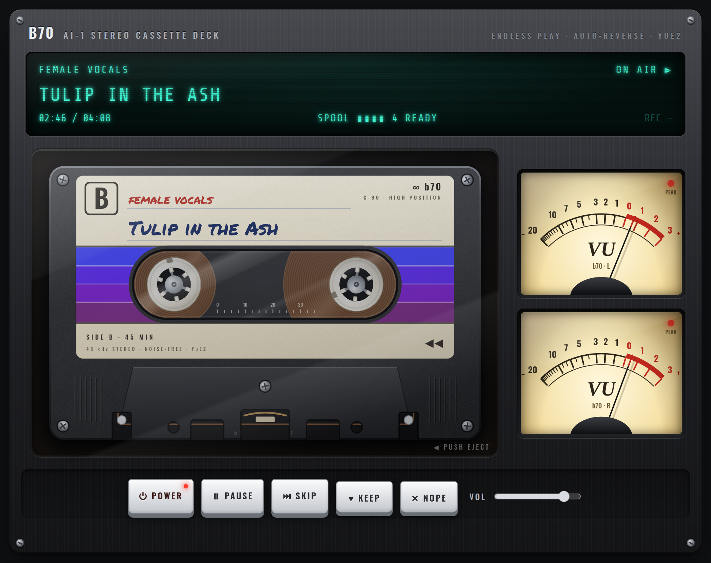
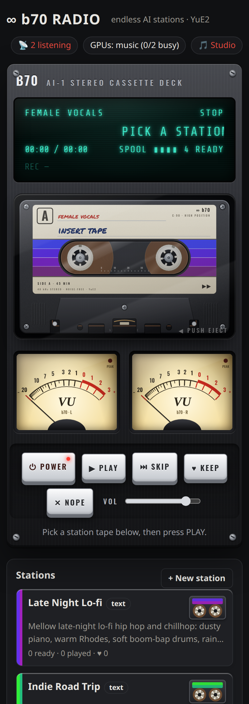
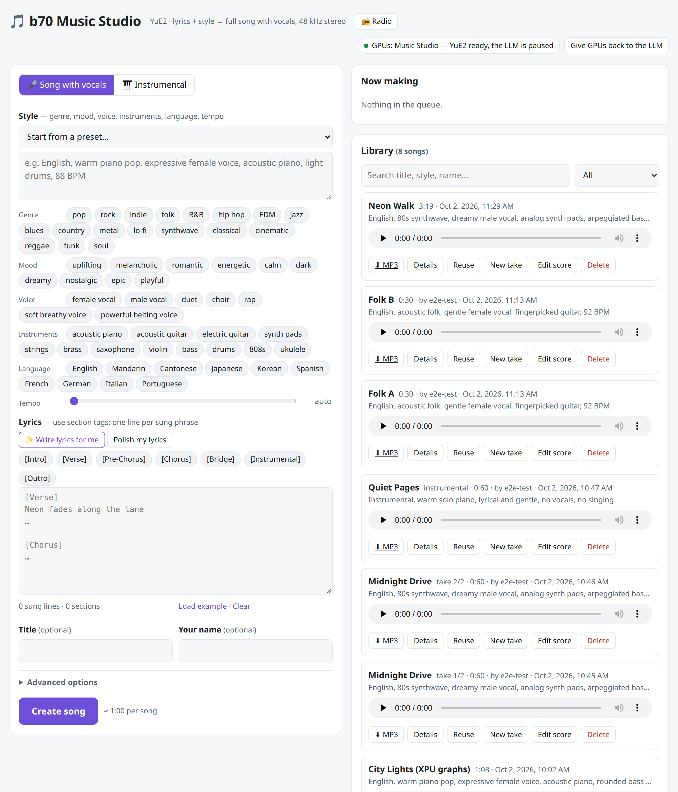

# yue2-xpu-radio

**Endless AI radio stations, written and performed live by [YuE2](https://github.com/multimodal-art-projection/YuE) on two Intel Arc Pro B70 GPUs.**

Describe a station ("early 90s hip hop, Salt-N-Pepa, TLC, Foxy Brown") or teach it by dropping in a folder of songs. An LLM writes each new song (title, style, lyrics), YuE2 sings it with full vocals at 48 kHz, a CLAP critic throws away the weak takes, and everyone listening hears the same live broadcast — in a cassette-deck web player or any MP3 player. Inspired by [infinite-tapedeck](https://github.com/CharlesMod/infinite-tapedeck).



The radio lives inside a small **Music Studio** (make individual songs or instrumentals, write lyrics with an LLM, edit the score), which owns the GPU queue. Both are plain Python stdlib HTTP servers — no web framework, no build step.

| Radio (phone) | Music Studio |
|---|---|
|  |  |

## What it does

- **Two kinds of stations.** *Text* stations are defined by a description. *Learned* stations analyze uploaded songs with CLAP + librosa (genre/mood/instrument tags, vocal share, tempo, key) and also pass the song names to the songwriter — the LLM usually knows the artists far better than the automatic tags do.
- **A songwriter LLM** (any OpenAI-compatible server) writes a JSON spec per song: title, style line, structured lyrics sized for ~2.5–3 minutes. It sees what aired recently, what you kept / skipped / disliked, and gets a random "variety axis" each time; overused title words are banned so stations don't collapse onto one idea.
- **YuE2 on every GPU.** One worker process per card (`xpu:0`, `xpu:1`) with XPU graphs, ~0.7× real time per card (a 3.5 min song renders in ~2.5 min), so two cards stay well ahead of playback.
- **A critic.** Each take is embedded with CLAP and scored against the station (its description, or the corpus of learned songs), nudged by your likes/dislikes, with a near-duplicate penalty. The bottom 15 % (text stations) or 30 % (learned) are dropped.
- **One shared broadcast.** A playout thread encodes approved tracks to a 192 kbps CBR MP3 stream at real time; every listener — the deck, VLC, a phone — gets the same audio (`/radio/stream.mp3`). New listeners get a 4 s burst so playback starts instantly; the deck works out which song is *audible* from the stream offset, so titles change exactly when the music does. Nobody listening → no songs are used up.
- **Feedback.** KEEP / SKIP / NOPE shape the station (SKIP and NOPE skip for everyone — it's one broadcast).
- **Shares the GPUs with an LLM.** The studio pauses the LLM service (e.g. vLLM) when it needs the cards and restarts it when the radio is switched off or someone presses *Give GPUs back*.
- **The deck.** A realistic cassette (SVG): tape packs whose radii follow the stream position as a 45-minute side and auto-reverse to side B, hubs that turn at real 4.76 cm/s tape speed (the small reel spins faster), backlit analog VU meters on Web Audio, a VFD, a hand-written label tinted per station.

## How it works

```
 station (text or learned) ─┐
 likes / skips / recent ────┼─> songwriter LLM ──JSON spec──> job queue ──> YuE2 worker xpu:0 ─┐
                            │                                             └> YuE2 worker xpu:1 ─┤
                            │                                                                    v
                            └──────────────────────── CLAP critic <── song.mp3 (320 kbps) <──────┘
                                                          │ approved
                                                          v
                         spool (keeps ~4 songs ahead) ──> playout (real-time pacing, 576-byte frames)
                                                          │
                              /radio/stream.mp3  <────────┴──> deck · VLC · phones (same audio)
```

- `studio/app.py` — studio server, job queue, GPU pool (spawned child process per GPU — the only reliable way to give all VRAM back), LLM pause/resume, lyrics writer, MP3 library.
- `studio/radio.py` — stations, CLAP listener, songwriter, spool, critic, broadcast/playout, `/api/radio/*`.
- `studio/index.html`, `studio/radio.html` — the two UIs (no dependencies besides Google Fonts, with system-font fallbacks).
- `patches/yue2-xpu.patch` — the YuE2 port to Intel XPU (below).

## Hardware and software it runs on

- 2 × Intel Arc Pro B70 (32 GB each, `xe` driver), Ryzen 9 3950X, 30 GB RAM, Ubuntu 26.04 / kernel 7.0
- Intel compute-runtime 26.35, PyTorch **2.14.0+xpu** (XPU graphs need torch ≥ 2.13), transformers 4.57, librosa 1.0, soundfile 0.13, numpy 2.2, ffmpeg
- Models: `m-a-p/YuE2-3B` + `m-a-p/YuE2-Vae`, CLAP `laion/clap-htsat-unfused` (CPU)
- Songwriter: Qwen3.8-27B on vLLM (any OpenAI-compatible chat model works; thinking is disabled via `chat_template_kwargs`)

It should also run on a single XPU or CUDA GPU (`STUDIO_DEVICES=cuda:0`); the patch is only needed for XPU.

## Setup

```bash
# 1. YuE2 with the XPU patch
git clone https://github.com/multimodal-art-projection/YuE.git ~/YuE
cd ~/YuE && git checkout 1dc1c50 && git apply ~/yue2-xpu-radio/patches/yue2-xpu.patch

# 2. a venv with PyTorch for XPU (or CUDA)
python3.12 -m venv ~/venv-yue2
~/venv-yue2/bin/pip install torch --index-url https://download.pytorch.org/whl/xpu
~/venv-yue2/bin/pip install -e ~/YuE librosa soundfile transformers
sudo apt install ffmpeg

# 3. run it
STUDIO_DEVICES=xpu:0,xpu:1 \
STUDIO_LYRICS_LLMS="http://localhost:8000/v1|qwen38|local LLM" \
STUDIO_INSTRUMENTAL=~/YuE/skills/yue2-music/instrumental/scripts \
~/venv-yue2/bin/python ~/yue2-xpu-radio/studio/app.py
```

Open `http://<host>:7860/` (studio) or `http://<host>:7860/radio`. For a service, see [`systemd/yue2-studio.service`](systemd/yue2-studio.service) and the narrow [`systemd/sudoers.example`](systemd/sudoers.example) that lets it stop/start only the LLM unit.

### Configuration

| Variable | Default | Meaning |
|---|---|---|
| `STUDIO_PORT` | `7860` | HTTP port |
| `STUDIO_DEVICES` | `xpu:0,xpu:1` | one YuE2 worker per device |
| `STUDIO_DATA` | `~/yue2/studio/library` | song library (`<id>/job.json`, `<id>/song.mp3`); radio state lives next to it |
| `STUDIO_LLM_UNIT` | `vllm-qwen38.service` | systemd unit paused while the studio holds the GPUs |
| `STUDIO_LYRICS_LLMS` | `http://localhost:8000/v1\|qwen38\|local LLM` | songwriter LLMs, `base_url\|model\|label`, comma-separated, tried in order. While the radio runs the local LLM is paused, so add a server on another machine. |
| `STUDIO_RETURN_MINUTES` | `0` | auto-return the GPUs after N idle minutes (0 = only on request / radio off) |
| `STUDIO_INSTRUMENTAL` | `~/yue2/YuE/skills/yue2-music/instrumental/scripts` | YuE2's instrumental helper scripts |

### Radio API (selection)

| | |
|---|---|
| `GET /radio/stream.mp3` | the live broadcast (open in VLC / any player) |
| `GET /api/radio/state` | stations, spool, GPU owner, stream position, what's on air |
| `POST /api/radio/power` `{on, station}` | switch on/off / retune (on = generate; pauses the LLM) |
| `POST /api/radio/skip` `{track, kind}` | skip (or `kind: "dislike"`) the song on air |
| `POST /api/radio/feedback` `{track, kind}` | `keep` / `skip` / `dislike` / `clear` |
| `POST /api/radio/stations` | create `{kind: "text"\|"folder", name, description, vocals, language}` |
| `PUT /api/radio/stations/<id>/files/<name>` | upload a song to a learned station, then `POST .../analyze` |

## The YuE2 XPU patch

Three small changes against upstream `1dc1c50` (`patches/yue2-xpu.patch`):

- **XPU graphs**: `GraphAR` captures with `torch.xpu.XPUGraph` / `torch.xpu.graph` / XPU streams, and token generation enables graphs on `xpu` (decode runs ~75 tok/s per B70).
- **Sync, RNG, cache**: `torch.xpu.synchronize`, an on-device `torch.Generator`, `torch.xpu.empty_cache`.
- **No AR offload before the VAE on XPU**: a 32 GB card holds the AR model and the VAE together; moving the 7 GB AR model to host RAM for every song cost time and, with two workers, exhausted a 30 GB host.

## Things we learned the hard way

- **A device fault poisons a process forever.** An `xe` engine reset (`Engine memory CAT error`) left one worker returning `UR_RESULT_ERROR_DEVICE_LOST` for every job — 185 instant failures while the station replayed the five songs that existed. Workers now restart on `DEVICE_LOST` or 3 consecutive failures, retire after repeated faults, and the spool backs off instead of hammering the songwriter.
- **The length cap was cutting songs off.** YuE2 caps semantic tokens at `max_seconds`; with 180 s, a quarter of songs stopped mid-phrase at full volume. The radio now uses 300 s as a safety cap (generation time follows the real length), sizes lyrics for ~2.5–3 min with an `[Outro]`, and fades out any take that still ends loud.
- **CLAP saturates within a genre.** Distinct songs on one station score 0.95–0.97 cosine against each other, clones 0.94–0.98 — so it's a soft novelty penalty, not a dedup. Variety has to come from the songwriter prompt.
- **Liked songs over-anchor.** "The listener loved X, lean toward it" turned a station into five variations of one song. Likes now set the vibe only; titles may not reuse recent words.
- **CLAP tags can be badly wrong** (a Zach Bryan station came out as "indie rock, punk, bossa nova, female vocals"). Passing the learned songs' names to the LLM fixed the station's sound immediately.
- **vLLM structured output + MTP speculative decoding** (xgrammar, `num_speculative_tokens: 3`, pipeline parallel) returned HTTP 500 for ~75 % of `response_format: json_object` requests ("grammar rejected tokens … Terminating request"). The songwriter doesn't use JSON mode; it parses and repairs the JSON itself (unterminated strings, stray backslashes).
- **Real-time MP3 pacing**: 192 kbps at 48 kHz gives exactly 576-byte frames (24 000 B/s), so byte offsets are time offsets and cuts can land on frame boundaries — skips never leave a torn frame.

## Credits and licenses

- Code in this repository: Apache-2.0 (see `LICENSE`).
- [YuE2](https://github.com/multimodal-art-projection/YuE) by M-A-P: code Apache-2.0; the model weights have their own license (`MODEL_LICENSE` upstream) — check it before using generated music.
- [CLAP](https://huggingface.co/laion/clap-htsat-unfused) by LAION. Idea: [infinite-tapedeck](https://github.com/CharlesMod/infinite-tapedeck) by CharlesMod.
- Songs you upload to learned stations stay on your machine and are only analyzed; they are not part of this repository.
